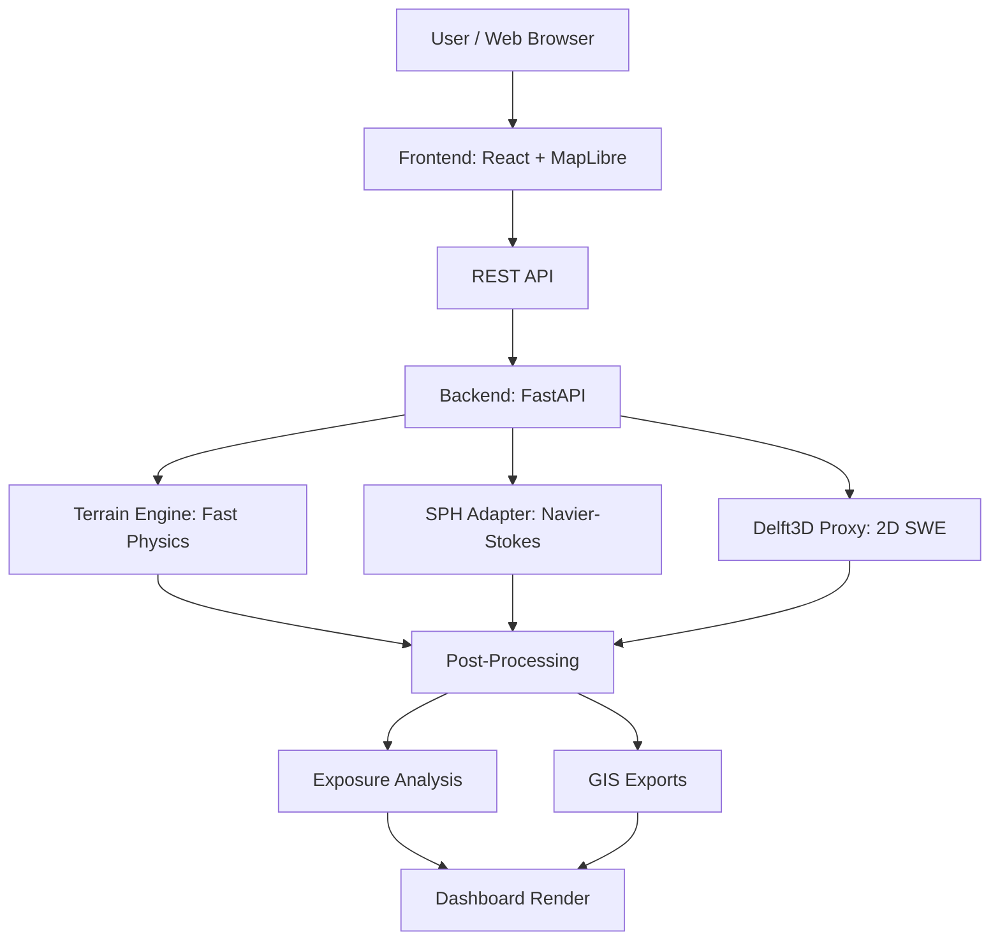
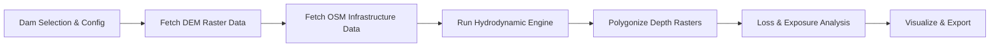

# A Generalized Hydrodynamic Framework for Rapid Dam-Break Inundation Modelling

**Project Type:** Software / GIS / Disaster Management  
**Problem Statement:** SIH26161 — Dam Break Inundation Modelling Using Hydrodynamic Modelling of any River (NTRO)  
**Team:** CTRL_ALT_WIN (SIH 2026)  

---

## 1. Abstract

Flash floods triggered by catastrophic dam failures or natural lake bursts present an acute threat to downstream catchments across India. During a crisis, decision-makers need to rapidly estimate the volume of water release, the spatial extent of inundation, the propagation velocity, and the exact settlements, roads, hospitals, and bridges at risk. 

This project introduces **HADR**, a comprehensive, generalized simulation framework that automates dam-break inundation modelling for any river system in India. The platform dynamically ingests open-source Digital Elevation Models (SRTM/ASTER), hydrological vector data from OpenStreetMap, and Sentinel-1 SAR imagery via Google Earth Engine. To balance emergency speed with scientific accuracy, the software implements a novel tri-model architecture, automates end-to-end Loss and Damage Analysis, and provides standard GIS exports (.shp, .kml, GeoJSON).

---

## 2. Introduction

### Background
In crisis situations requiring emergency water release or in the event of a catastrophic dam break, estimating the volume of water propagation, flow velocity, and the exact spatial extent of downstream inundation is critical for effective Humanitarian Assistance and Disaster Relief (HADR). Existing hydrodynamic models (Delft3D, HEC-RAS) require days of setup and specialized hardware, making them impractical for immediate emergency response.

### Objectives
1. Build a generalized framework capable of simulating dam break scenarios on ANY river using open-source data.
2. Implement and integrate three distinct hydrodynamic engines for scientific model comparison.
3. Automate Loss and Damage Analysis against real infrastructure data.
4. Integrate Google Earth Engine for near real-time Sentinel-1 SAR flood verification.
5. Provide a scalable, interactive Dashboard GUI with GIS exports.

---

## 3. Methodology & Architecture

The HADR platform utilizes three core hydrodynamic engines to balance speed and accuracy:
1. **Terrain Routing Engine:** Physics-based slope routing using broad-crested weir breach hydrograph. Generates inundation bounds in under 1 second.
2. **SPH Solver:** Lagrangian particle-based Navier-Stokes solver with cKDTree spatial partitioning and Monaghan Artificial Viscosity.
3. **Delft3D Proxy (2D SWE):** Eulerian grid-based 2D Shallow Water Equation solver with Lax-Friedrichs shock stabilization and adaptive CFL time-stepping.

### System Architecture



### System Workflow



### Technology Stack

| Layer | Technology | Purpose |
|-------|------------|---------|
| Frontend | React, MapLibre GL JS, Tailwind | Interactive dashboard and WebGL mapping |
| Backend | FastAPI (Python 3.10+) | High-performance async REST API server |
| Spatial Libs | NumPy, SciPy, Rasterio, Shapely | Raster computation and vector intersection |
| Data Processing | Java Osmosis, pyosmium | Fast offline OSM infrastructure extraction |
| Satellite | Google Earth Engine (ee API) | Sentinel-1 SAR flood verification mapping |

---

## 4. Key Features & Experimental Results

- **Multi-Model Architecture:** Compare Terrain Routing, SPH, and Delft3D (SWE) predictions in real-time.
- **Automated Loss & Damage:** Computes financial exposure, exposed populations, and critical infrastructure at risk.
- **Real-Time Satellite Verification:** Integrates with Google Earth Engine using Sentinel-1 SAR.
- **Universal Dam Support:** Ships with 48 pre-loaded Indian dams and supports dynamic simulation for any custom dam worldwide.

### Sample Data (Input)
Example of the input data format used to run a simulation for a custom dam:
```json
{
  "dam_id": "custom",
  "release_percent": 50.0,
  "duration_min": 720,
  "time_step_min": 60,
  "engine": "sph",
  "custom_lat": 30.377,
  "custom_lon": 78.481,
  "custom_name": "Tehri Dam (Custom)",
  "custom_height_m": 260.0,
  "custom_river": "Bhagirathi"
}
```

### Sample Output (Exposure Analysis)
The simulation provides details about the flood extent and the exposure analysis:
```json
{
  "total_settlements_affected": 23,
  "total_population_exposed": 145000,
  "flooded_road_km": 87.3,
  "hospitals_at_risk": 4,
  "estimated_financial_loss_cr": 2340.5,
  "evacuation_status": {
    "mandatory_evacuation": 8,
    "high_risk": 9,
    "low_risk": 6
  }
}
```

---

## 5. Implementation & Setup

### Prerequisites
- Python 3.10+
- Node.js (v18+)
- Java (for Osmosis processing)

### Installation

1. Clone the repository:
```bash
git clone https://github.com/sumitESC/HADR.git
cd HADR
```

2. Setup the backend:
```bash
cd backend
python -m venv venv
# Windows
venv\Scripts\activate
# Linux/macOS
source venv/bin/activate

pip install -r requirements.txt
```

3. Setup the frontend:
```bash
cd ../frontend
npm install
```

4. Run the application:
```bash
# From the root folder
python run.py
```
This will start the FastAPI backend on `http://127.0.0.1:8000` and the Vite React frontend on `http://localhost:5173/`.

---

## 6. Team CTRL_ALT_WIN

- Sumit Kushwaha (Team Leader)
- Tanu Gupta
- Somya Dwivedi
- Suryansh Mishra
- Vansh Jaiswal
- Ujjwal Srivastava

## 7. Conclusion & License

This framework transitions complex hydrodynamic modelling into a real-time, interactive, web-based dashboard accessible to disaster management authorities. The project demonstrates that advanced hydrodynamic modelling can be made accessible, fast, and actionable.

Developed as part of the Smart India Hackathon 2026 for the National Technical Research Organisation (NTRO). The source code is released under the MIT License for educational and research purposes. All open-source data sources (SRTM, OSM, Sentinel-1) are used in compliance with their respective licensing terms.
