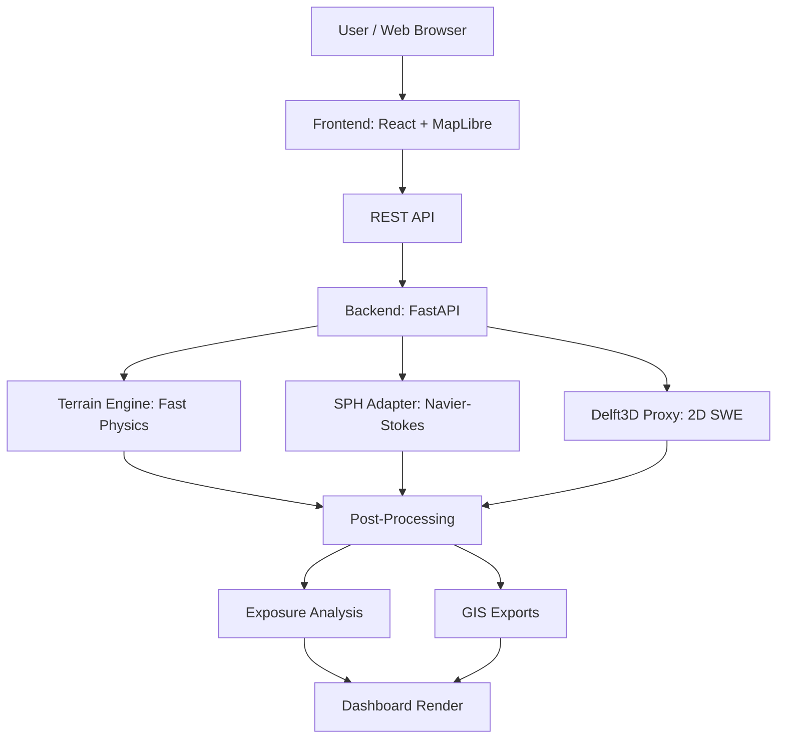
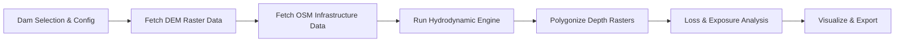

# HADR - Dam Break Flood Simulation System

This is a flood simulation system our team (CTRL_ALT_WIN) built for Smart India Hackathon 2026 (Problem Statement SIH26161 by NTRO). The goal is to quickly simulate what happens when a dam breaks and how much damage it would cause downstream, using various mapping and physics models.

## What it does

When a dam fails, people need to know where the water will go right away. Our project helps with that by using map data (like DEMs for elevation and OSM for roads/buildings) to run flood simulations. 

We used three different ways to simulate the water flow:
1. **Terrain Routing Engine:** A really fast physics-based approach to get quick predictions.
2. **Smooth Particle Hydrodynamics (SPH):** We implemented this to simulate water particles moving over time.
3. **Delft3D proxy:** A grid-based 2D shallow water equation solver.

It also calculates the estimated damage to buildings, roads, and hospitals, and you can export the results to .shp, .kml, or GeoJSON.

## Architecture Diagram



## Workflow



## Tech Stack

| Layer | Technology | Purpose |
|-------|------------|---------|
| Frontend | React, MapLibre GL JS, Tailwind | Interactive dashboard and WebGL mapping |
| Backend | FastAPI (Python 3.10+) | High-performance async REST API server |
| Spatial Libs | NumPy, SciPy, Rasterio, Shapely | Raster computation and vector intersection |
| Data Processing | Java Osmosis, pyosmium | Fast offline OSM infrastructure extraction |
| Satellite | Google Earth Engine (ee API) | Sentinel-1 SAR flood verification mapping |

## How to run the code

1. Clone the repo:
```bash
git clone https://github.com/sumitESC/HADR.git
cd HADR
```

2. Setup the backend:
```bash
cd backend
python -m venv venv
# On Windows use: venv\Scripts\activate
# On Mac/Linux use: source venv/bin/activate
pip install -r requirements.txt
```

3. Setup the frontend:
```bash
cd ../frontend
npm install
```

4. Run the app:
From the root folder, just run:
```bash
python run.py
```
This will start both the backend on http://127.0.0.1:8000 and the frontend on http://localhost:5173/.

## Sample Data (Input)
Here is an example of the input data format used to run a simulation for a custom dam:
```json
{
  "dam_id": "custom",
  "release_percent": 50.0,
  "duration_min": 720,
  "time_step_min": 60,
  "engine": "sph",
  "custom_lat": 30.377,
  "custom_lon": 78.481,
  "custom_name": "Tehri Dam (Custom)",
  "custom_height_m": 260.0,
  "custom_river": "Bhagirathi"
}
```

## Sample Output
The simulation provides details about the flood extent and the exposure analysis:
```json
{
  "total_settlements_affected": 23,
  "total_population_exposed": 145000,
  "flooded_road_km": 87.3,
  "hospitals_at_risk": 4,
  "estimated_financial_loss_cr": 2340.5,
  "evacuation_status": {
    "mandatory_evacuation": 8,
    "high_risk": 9,
    "low_risk": 6
  }
}
```

## Team
- Sumit Kushwaha (Team Leader)
- Tanu Gupta
- Somya Dwivedi
- Suryansh Mishra
- Vansh Jaiswal
- Ujjwal Srivastava

## License
Built for educational purposes during SIH 2026. Data used from open sources.
